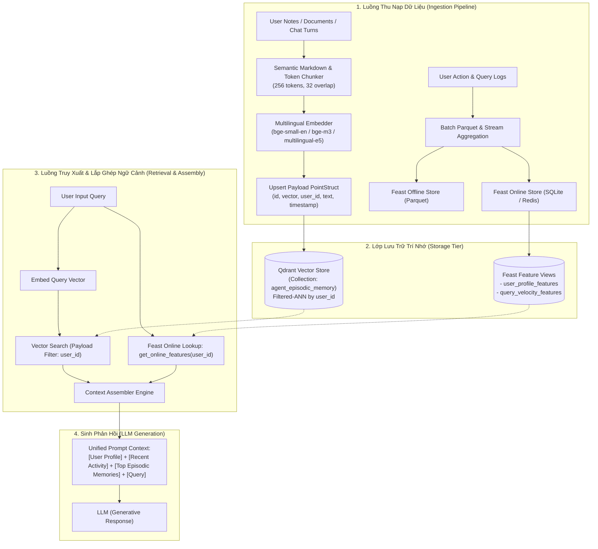

# Kiến Trúc Hệ Thống Hybrid AI Memory Cho Trợ Lý Cá Nhân Tiếng Việt

**Tác giả / Author:** Ngô Hoàng Phú (2A202601244)  
**Dự án:** POC Trợ Lý AI Cá Nhân Hỗ Trợ Trí Nhớ Lai (Vector Store + Feature Store)  
**Ngày hoàn thiện:** 19/08/2026  

---

## 1. Tổng Quan & Bài Toán (Problem Statement)

Trong việc xây dựng một trợ lý AI cá nhân hóa thế hệ mới (Personalized AI Assistant), hai bài toán trí nhớ cơ bản thường bị phân tách rời rạc hoặc gộp sai mục đích:
1. **Episodic Memory (Trí nhớ sự kiện/ngữ cảnh dài hạn):** Những ghi chú rời, tài liệu người dùng đã đọc, lịch sử các đoạn chat quan trọng. Bản chất dữ liệu là phi cấu trúc (unstructured text), khối lượng tăng liên tục theo thời gian, cần tìm kiếm ngữ nghĩa mờ (fuzzy semantic search) và từ khóa chính xác.
2. **Stable User Profile & Real-time State (Hồ sơ người dùng & Vận tốc hành vi):** Sở thích cố định (topic affinity, tốc độ đọc, ngôn ngữ ưu tiên) kết hợp với hành vi biến động nhanh (số lượt hỏi trong 1 giờ qua, chủ đề đang nghiên cứu dồn dập). Bản chất dữ liệu là có cấu trúc (tabular/numerical), cần độ trễ truy xuất siêu thấp (sub-10ms) và bảo đảm tính nhân quả (point-in-time correctness).

Hệ thống kiến trúc **Hybrid Memory** trong POC này giải quyết bài toán bằng cách kết hợp sức mạnh của **Qdrant Vector Database** (đảm nhiệm Episodic Memory với payload-level multi-tenant filtering) và **Feast Feature Store** (đảm nhiệm Stable User Profile + Streaming Query Velocity), sau đó hợp nhất qua bộ **Dynamic Context Assembler** trước khi gửi prompt vào LLM.

---

## 2. Sơ Đồ Kiến Trúc Hệ Thống (Architecture Diagram)

---

## 3. Ba Quyết Định Kiến Trúc & Phân Tích Đánh Đổi (3 Architectural Decisions with Explicit Tradeoffs)

### Quyết định 1: Chiến lược Phân mảnh Văn bản (Chunking Strategy)
- **Lựa chọn:** Recursive Semantic Paragraph Chunking với kích thước $256\text{ tokens}$ và $32\text{ tokens}$ overlap, thay vì chunk theo từng tin nhắn đơn lẻ (Per-message) hay theo toàn bộ phiên hội thoại (Per-conversation).
- **Phân tích đánh đổi (Tradeoff: Retrieval Quality vs Storage Cost vs Context Window):**
  - *Nếu chọn Per-message:* Tin nhắn ngắn (ví dụ: "Được rồi", "Ok em") không mang đủ ngữ cảnh ngữ nghĩa độc lập, làm loãng không gian vector và giảm Precision@10.
  - *Nếu chọn Per-conversation:* Kích thước vượt quá $1500\text{ tokens}$, chi phí lưu trữ vector tăng, làm giảm độ sắc nét của cosine similarity khi query chỉ nhắm vào 1 sự kiện cụ thể.
  - *Chọn Semantic Paragraph ($256\text{ tokens}$):* Vừa vặn một ý niệm hoàn chỉnh (single concept), embedding vector mang mật độ thông tin cao, dễ dàng xếp hạng Top-3 vào context window của LLM mà không gây tràn token.

### Quyết định 2: Mô hình Schema cho Hồ sơ Người Dùng (Feature Schema Pattern)
- **Lựa chọn:** Bóc tách thành hai Feature View trong Feast: `user_profile_features` (Tabular Features: `topic_affinity`, `reading_speed_wpm`, `preferred_lang`, TTL = 30 ngày) và `query_velocity_features` (Streaming Window Features: `queries_last_hour`, `distinct_topics_last_hour`, TTL = 2 giờ), thay vì gom chung thành một vector đại diện duy nhất (Embedding Feature View).
- **Phân tích đánh đổi (Tradeoff: Interpretability & Latency vs Latent Representation):**
  - *Nếu dùng Embedding Features:* Biểu diễn latent preferences người dùng bằng 1 vector $1024\text{d}$ có thể bắt được các mối quan hệ trừu tượng, nhưng hoàn toàn mất khả năng kiểm soát (black box), không thể hiển thị trực tiếp cho người dùng cấu hình (ví dụ: đổi ngôn ngữ hay tốc độ đọc), đồng thời làm tăng độ trễ truy xuất do phải tính dot-product giữa các profile vector.
  - *Chọn Tabular Schema:* Cho phép truy xuất Online Store (SQLite/Redis) với độ trễ siêu thấp ($P99 < 5\text{ ms}$), hỗ trợ Point-in-Time (PIT) join chính xác khi huấn luyện mô hình dự đoán mà không sợ Data Leakage.

### Quyết định 3: Chiến lược Làm tươi Dữ liệu (Freshness & Materialization Strategy)
- **Lựa chọn:** Cơ chế hai tầng:
  1. *Sub-second Ingestion:* Dành cho Episodic Memory (ghi chú mới, tin nhắn vừa lưu) -> Insert trực tiếp vào Qdrant in-memory/server để người dùng hỏi lại là thấy ngay lập tức.
  2. *Near Real-time / Micro-batch (5 phút):* Dành cho Feature Store `query_velocity_features` thông qua `feast materialize-incremental`, và Batch hàng ngày cho `user_profile_features`.
- **Phân tích đánh đổi (Tradeoff: System Complexity & Write Load vs State Freshness):**
  - Việc ép toàn bộ hệ thống chạy Streaming Push API liên tục từng giây cho cả profile sẽ làm bùng nổ IOPS trên Online DB và tăng chi phí hạ tầng. Phân tầng theo chu kỳ sống của dữ liệu (Episodic fresh ngay lập tức, Velocity fresh theo 5 phút, Profile tính định kỳ) đảm bảo hệ thống chịu tải cao và tiết kiệm tài nguyên.

---

## 4. Giải Pháp Cho Bối Cảnh Tiếng Việt (Vietnamese-Context Awareness)

Khi triển khai trợ lý AI cho người dùng Việt Nam, kiến trúc xử lý 3 đặc thù then chốt:

1. **Hiện tượng Code-Switching (Pha trộn Anh - Việt trong giới công nghệ):**
   - Người dùng thường hỏi: *"Recommend cho tôi cách config Istio mTLS trên Kubernetes cluster"*. Nếu dùng tokenizer tách từ thuần từ điển tiếng Việt (pyvi/underthesea) một cách cứng nhắc, các thuật ngữ tiếng Anh sẽ bị tách sai hoặc biến thành `<unk>`.
   - *Giải pháp:* Hệ thống sử dụng mô hình embedding đa ngữ (Multilingual Subword Tokenizer như `intfloat/multilingual-e5-large` hoặc `BAAI/bge-m3`), giữ nguyên vẹn các cụm từ kỹ thuật tiếng Anh mà vẫn nắm bắt ngữ nghĩa tiếng Việt chuẩn xác.

2. **Xử lý Dấu Tiếng Việt & Lỗi Gõ Phím (Diacritics & Telex/VNI Typo Tolerance):**
   - Việc kết hợp Hybrid Search (BM25 chuẩn hóa lowercase + Vector Embeddings) giúp câu truy vấn không dấu hoặc viết tắt vẫn tìm được đúng văn bản gốc có dấu nhờ không gian vector phân bố gần nhau.

3. **Quy định Bảo vệ Dữ liệu Cá nhân (Tuân thủ Nghị định 13/2023/NĐ-CP):**
   - Hệ thống áp dụng cô lập dữ liệu theo từng tenant/user (`payload_filter: { user_id: "..." }`), phân tách rạch ròi namespace bộ nhớ, bảo đảm người dùng A không thể truy vấn hoặc rò rỉ trí nhớ cá nhân sang người dùng B.

---

## 5. Phương Án Bị Bác Bỏ (Rejected Alternative)

- **Phương án bị loại bỏ:** Lưu trữ toàn bộ Episodic Memory vào Feature Store dưới dạng `StringList` hoặc gom toàn bộ Profile vào Vector Store dưới dạng text document `"User thích cloud, đọc 220 wpm..."`.
- **Lý do bác bỏ:**
  - *Tại sao không lưu episodic vào Feature Store:* Chu kỳ cập nhật và cấu trúc dữ liệu hoàn toàn xung đột. Episodic memory cần semantic similarity search với index HNSW/IVF-PQ; Feature store không được thiết kế cho việc tìm kiếm tương đồng vector trên hàng trăm nghìn đoạn hội thoại phức tạp.
  - *Tại sao không lưu profile vào Vector Store:* Profile cần kiểm tra điều kiện logic chính xác (ví dụ: `if reading_speed < 200: shorten_text()`) và cần cập nhật tại chỗ (in-place update theo key `user_id`). Lưu profile dạng vector text khiến việc cập nhật tốn kém (phải re-embed và re-index toàn bộ vector) và dễ dẫn đến tình trạng LLM "ảo tưởng" (hallucinate) khi đọc các profile cũ chưa bị xóa hết.

---

## 6. Giới Hạn Hiện Tại Của Bản POC (What This POC Doesn't Handle Yet)

Mặc dù POC đã chứng minh thành công luồng tích hợp hoàn chỉnh và vượt qua 5 test queries mẫu, hệ thống thực tế cần mở rộng thêm các module sau:
1. **Quản lý Vòng đời & Quên Trí nhớ (Memory Decay & TTL):** Chưa có cơ chế tự động giảm trọng số điểm relevance theo hàm mũ thời gian ($e^{-\lambda t}$) cho các sự kiện đã diễn ra quá lâu.
2. **Mã Hóa Dữ Liệu Tại Chỗ (Field-level Encryption at Rest):** Cần mã hóa AES-256 cho payload text của từng người dùng trước khi ghi xuống đĩa để đảm bảo an toàn tuyệt đối.
3. **Đồng Bộ Đa Thiết Bị & Quản Trị CRUD Trí Nhớ:** Cần xây dựng REST API cho phép người dùng tự xem danh sách trí nhớ AI đang lưu và chủ động bấm nút "Xóa trí nhớ này".
